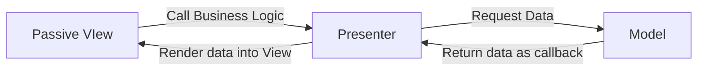
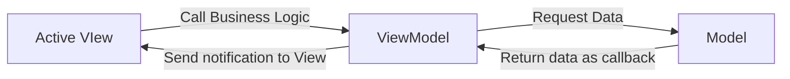

# 아키텍처
### 우리가 아키텍쳐를 사용하면 좋은이유
1. 일관적인 코드작성.
2. 테스트의 용이성

### 개발 시 사용하는 일반적인 아키텍처 
1. **MVC** : Model + View + Controller
-> **비즈니스로직**과 **뷰**의 분리가 어려움 				
				 	
2. **MVP** : Model + View(ViewController) + Presenter
-> view는 인터페이스의 뷰 or 액티비티나 프래그먼트같은 컨트롤러에 인터페이스를 구현하여 뷰 콜백을 받을 수 있도록 함,
Presenter : 모델과 뷰를 함께 관리. 인터페이스를 통해 뷰에 넣어줄 데이터를 단순하게 추상화

3. **MVVM** : Model + View(ViewController) + ViewModel
- 뷰와 뷰모델이 분리되어있는 특징

- 뷰는 뷰모델을 알고있지만 뷰모델은 뷰를 모름 (단방향 제어)

- 뷰모델에서는 모델의 데이터를 받아서 제어. 

- 모델의 데이터 변형시 뷰모델에서 변형된 데이터 브로드캐스팅 . 

- 뷰에서는 옵저빙할 옵저버 패턴을 통해서 뷰모델에서 직접 구독할 수 있는 데이터홀더 클래스를 구독하거나 옵저버 패턴을 통한 콜백을 통해서 변형시 뷰가 변형.

4. **MVVM** + DataBinding

- 위의 컨트롤러에 보일러플레이트 코드 제거

### MVP 

Passive VIew : Activity, Fragment (비즈니스로직을 프레젠터에서 호출)
Presenter : Mediator(데이터 레이어나 usecase를 통해 모델에 접근, 가공하여 처리)
Model : 데이터를 가져왔을 시 콜백으로 던져줄 수 있도록 구성.

**Presenter** : Contrller와 역할이 비슷하지만 **Interface를 사용한다는 것**의 차이가 있다. View에서 전달된 이벤트에 따라 Model에서 데이터 요청후 전달하는 중간 역할 담당.

*View  
액티비티 혹은 프래그먼트가 오로지 View의 역할만 담당하게 되어 View/Control이 아닌 View에 관련된 내용만 표시하게 된다. View 인터페이스를 구현하여 해당 View를 담당할 Presenter에서 컨트롤하게 하는 것이다. 이렇게 되면 특정 뷰와 상관없이 가상 뷰를 구현하여 간단한 유닛테스트를 할 수 있게된다.  
  
*Presenter  
본질적으로 MVC의 컨트롤러와 같지만, 뷰에 연결되는 것이 아닌 단순히 인터페이스라는 점이 다르다. 극단적으로 MVP를 구현하는 방법은 Presenter가 절대로 어떠한 안드로이드 API나 코드가 참조되지 않도록 하는 것이다.

### MVVM

_mvp패턴에서 presenter의 문제점이 있다._  
_컨트롤러와 마찬가지로 시간이 지남에 따라 추가되는 비즈니스 로직이 모이게 된다. 시간이 흐르면 거대하고 다루기 어렵고 문제가 발생하기 쉽고 분리하기 어려운 presenter를 발견하게 된다. *신중한 개발자라면 앱의 변화에 맞춰 해결해 나갈 수 있다._

뷰 컨트롤러에 구독하는 방식
액티비티나 프래그먼트에서 직접적으로 비즈니스로직을 뷰모델에 호출.
매개체인 뷰모델은 라이프사이클에 맞게 데이터 홀더클래스로 구성하여 데이터를 모델에 접근해서 가공해서 가져오고 난 이후 데이터 변경시 데이터 홀더클래스에 담아서 success or error형태로 가져옴.

브로드캐스팅하여 기존 active view에서는 구독하고 있고 데이터 변형시 적극적으로 뷰 변경사항을 처리. 

- Model, View, ViewModel의 약자  
- 뷰와 모델을 연결하기 위해 사용해야하는 연결 코드 감소  
- MVP에서 파생된 패턴  
- Microsoft에 의해 제안된 패턴  
  
*Model : MVC, MVP와 동일하다.  
*View : ViewModel에 의해 보여지는 Observable변수와 액션에 유연하게 바인딩된다.  
*ViewModel : Model을 래핑하고 View에 필요한 Observable 데이터를 준비한다.  
-> View가 Model에 이벤트를 전달하도록 Hook을 준비한다.  
-> ViewModel은 View에 종속되지 않는다.

### MVVM + Databinding

- 데이터바인딩을 이용하여 구독에 대한 처리를 뷰 컨트롤러에서 하지 않음. XML에 데이터바인딩expression을 이용.
- XML에서 직접 ViewModel을 호출. 양방향 바인딩으로 처리되어 데이터 옵저빙도 바로 가능.
- 뷰모델 같은 경우 XML에서 직접 호출이 된 함수를 가져다가 모델을 통해 접근하여 가공하고 가공한 데이터를 가지고 다시 한 번 데이터 바인딩 기술을 통해 뷰에 직접적으로 뿌려줌.

DataBinding은 View와 ViewModel 간의 데이터와 명령을 연결해주는 매개체가 되어 서로의 존재를 명확히 알지 않더라도 상호작용 할 수 있도록 도와준다.  
Model에서 데이터가 변경되면 ViewModel을 거쳐 View로 전달되도록 하며 안드로이드에서는 LiveData 혹은 RxJava 등을 통해 구현할 수 있다.  
_*MVVM을 아무런 도움없이 구현하면 기존의 문제점을 개선하는 과정에서 새로운 문제가 발생할 수 있다. 그렇기 때문에 Databinding 이라는 툴을 이용하여 View와 ViewModel간의 의존성을 낮춰서 사용할 때 MVVM의 진가가 발휘된다는 점을 기억해두자._

## 클린 아키텍쳐 빌드업

### 클린 아키텍처를 구현하기 위한 세가지 레이어로 나누기

-  Presentation Layer
	 - 뷰(Activity, Fragment)와 프레젠터(Controller, Presenter, ViewModel)
	- 비즈니스 로직 작성, UI 표시(뷰모델, 액티비티,프래그먼트)
	
- Domain Layer
	- useCase
	- Translater(Entity -> model)
	
- Data Layer
	- Repository
		- Domain과 Data Store, Remote Layer를 연결하기 위함
	- Entity
		- 최소단위의 비즈니스 개체
	- DAO, ROOM과 같은 요소
