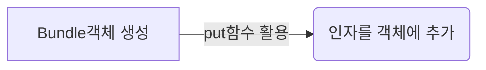

# CriminalIntent

# chapter11 
## RoomDatabase

장시간 데이터를 저장할 곳이 필요한 상황에는 어디에 저장을 할까?
이 챕터에서는 룸 라이브러리를 사용하여 데이터베이스를 쿼리할 수 있는 코드를 구현할 예정.

chapter4에서 장치 회전 및 프로세스 종료 시 **ViewModel과 SIS**를 사용하여 일시적 UI상태 데이터를 지속하였음.
UI와 무관하게 영구적으로 지속할 필요가 있는 데이터 저장에 사용 불가

**room**은 Jetpack의 아키텍처 컴포넌트 라이브러리.
데이터베이스 설정과 사용을 쉽게 도와줌.(애노테이션이 지정된 코틀린클래스로 데이터베이스 구조와 쿼리 정의)

###룸의 구성 
- API
- Annotation
- 컴파일러 

### 데이터 베이스 생성(룸은 아래 세가지를 수월하게 만들어줌)
- **모델 클래스**에 애노테이션을 지정(데이터베이스 Entity로 만든다)      
     @Entity를 앞에 붙임.
     데이터베이스 테이블의 구조를 정의함
     테이블의 각 행(row)을 담당
     속성에 @Primary키 애노테이션을 추가하므로서 기본키 지정
- **데이터베이스 자체를 나타내는 클래스** 생성
    특정 엔티티 클래스는 여러 데이터베이스에서 사용가능. 따라서 엔티티 클래스를 데이터베이스와 연관시켜주어야함. 
    @Database 에노테이션은 해당 클래스가 데이터베이스라는 표시
    첫번 째 매개변수 : 사용할 엔티티 클래스
    두번 째 매개변수 : 데이터베이스 버전
    RoomDatabase의 서브클래스, abstract로 지정
    
- 데이터베이스가 모델 데이터를 처리할 수 있게 **타입 변환기** 생성
	룸은 내부적으로 SQLite를 사용.
    오픈소스 관계형 데이터베이스
    코틀린 객체와 데이터베이스 사이에서 객체-관계 매핑(ORM)
    룸은 기본데이터 타입을 SQLite DB에 쉽게 저장할 수 있지만, 다른타입은 문제발생(타입변환기 필요성)
    변환기 클래스 안에 @TypeConverter애노테이션을 사용하여 함수 선언
    변환기 클래스를 데이터베이스 클래스에 추가.
    
### DAO 정의
- DAO는 데이터베이스 작업을 수행하는 함수들을 포함하는 인터페이스 -> 구현하는 클래스 룸이 생성
- DB 테이블 데이터에 액세스하기 위해 DAO(Data Access Object)필요
- @DAO 애노테이션 지정 -> Room이 DAO중 하나임을 알게됨
- 데이터베이스 클래스에 Dao를 등록
- @Query 애노테이션은 함수가 데이터베이스의 데이터를 읽는 다는 것을 나타냄
- @Query 애노테이션은 문자열로 된 SQL 명령을 받는다.

### 리포지터리 패턴으로 데이터베이스 액세스
- 데이터베이스를 액세스를 위해 구글 앱 아키텍처 지침에서 권장하는 리포지터리 패턴사용
	**리포지터리 클래스** 리포지토리(데이터 저장소) 구현
- 레포지토리 구현
	싱글톤 패턴으로 구현 (앱이 실행되는 동안 하나의 인스턴스만 생성)
    액티비티나 프래그먼트의 생명주기 상태가 변경되어도 계속 유지
    데이터를 갖고 있으면서 컨트롤러 클래스 간의 데이터를 쉽게 전달하는 방법을 제공
    생성자 private으로 지정(앱이 시작될 때만 생성-> Application 서브클래스)
- Application.onCreate()
	앱이 최초로 메모리에 로드될 때 안드로이드 시스템이 자동호출 . 한번만 초기화되는 작업 수행에 적합
    매니페스트에 등록필요.
- 레포지토리에 데이터베이스 객체와 DAO객체의 참조를 저장하는 두개의 속성 추가.
	Room.databaseBuilder() -> 데이터베이스 실체 클래스 생성.
- Dao 데이터베이스 액세스 함수들을 레포지토리에서 사용하기 위한 함수를 추가.

### 쿼리 테스트하기
----------------------
리포지터리가 준비된 상황

**모의데이터 업로드** 할 때?

	장치 파일 탐색기(Device File Explore)를 이용하여 에뮬레이터에 파일을 업로드.

 - [ ] 에뮬레이터는 루트권한으로 사용가능하지만 실제 장치는 권한이 없어서 불가.

### 테스트 데이터베이스 업로드
----------------------
안드로이드 장치의 각 애플리케이션은 자신의 **샌드박스**에 디렉터리를 가짐

	샌드박스란 외부로부터 들어온 프로그램이 보호된 영역에서 동작해 시스템이 부정하게 조작되는 것을 막는 보안형태
	안드로이드는 외부에서 다운받은 앱을Dalvic샌드박스 내에서만 실행시켜 시스템을 보호

샌드박스에 파일 저장 시 다른 사용자 액세스 방지(루팅 제외)

샌드박스 디렉터리는 **/data/data/패키지이름** 

샌드박스 디렉터리에 업로드하여 모의데이터 테스트

### 어플리케이션 스레드
----------------------
어플 실행시 **에러가 발생**하는데 이는 UI를 차단하는 **데이터베이스 액세스를 main 스레드에서 사용**하였기 때문.

데이터베이스 액세스와 같은 작업은 **백그라운드에서 수행**.

**스레드**란

	단일의 실행 시퀀스
모든 안드로이드 앱은 **main스레드**로 시작.
	
	main스레드는 무한 루프에 머물면서 사용자나 시스템이 유발한 이벤트를 기다림.

 - main스레드는 UI를 변경하는 모든 코드를 실행
 - 어떤 형태로든 모두 UI와 관련이 있어서 main스레드를 UI스레드라고도 함.

### 백그라운드 스레드
----------------------
데이터베이스 액세스로 인해 UI는 멈추고 ANR결과 초래

-> 백그라운드 스레드를 생성하여 데이터베이스 액세스

**백그라운드 스레드 추가시 규칙 2가지**
- 장시간 실행되는 모든 작업은 모두 백그라운드 스레드로 수행.
- UI는 main스레드에서만 변경 가능.

**백그라운드 스레드로 작업하는 방법**

- 비동기 네트워크 요청(24장)
- 핸들러 사용(25장)
- WorkManager 사용하여 주기적인 백그라운드 작업(27장)
- **LiveData, Executor사용**

### LiveData 사용하기
----------------------
**LiveData란?**
	Jetpack의 lifecycle-extensions라이브러리에 있는 데이터 홀더 클래스. 
	룸에서 LiveData 사용.

- **LiveData의 목적**은 앱의 서로 다른 부분간 데이터 전달을 쉽게 만드는 것 
- 스레드 간에도 데이터를 전달할 수 있어서 백그라운드 스레드에서 main스레드로 전달 가능

>  1. Room Dao의 쿼리에서 LiveData반환하도록 구성.
>  
>  2. Room이 백그라운드 스레드에서 쿼리 작업 자동 실행후 LiveData 객체 반환.
>  
>  3. 액티비티나 프래그먼트에서 LiveData객체 관찰하도록 설정

뷰모델에 저장된 LiveData를 참조

LiveData로 반환될 때 프래그먼트에서 Observer 사용

LiveData.observer함수는 LiveData인스턴스에 옵저버를 등록하기위해 사용.

# chapter12 프래그먼트

이 챕터에서 CriminalIntent 앱의 범죄 리스트와 상세내역을 연동하였습니다.

CrimeListFragment와 CrimeFragment 두 프래그먼트가 존재

**할일**
- 호스팅 액티비티가 프래그먼트들을 바꿔치기해서 이동 구현 방법.

- 프래그먼트 인자(fragment argument)사용
- 프래그먼트 인스턴스에게 데이터를 전달하는 방법
- UI 변경에 따라 LiveData를 변환하는 방법.

### 단일 액티비티 : 프래그먼트의 우두머리

호스팅 액티비티 FragmentManager에서 새로운 프래그먼트의 트랜잭션을 시작하는 코드를 추가(뷰홀더 onClick 안에).

	fun onClick(view: View){
		val fragment = CrimeFragment.newInstance(crime.id)
		val fm = activity.supportFragmentManager
		fm.beginTransaction()
			.replace(R.id.fragment_container, fragment)
			.commit

->프래그먼트가 독자적이고 구성가능한 단위가 아님(프래그먼트의 독립성)

-> 다른 **프래그먼트로 교체하는일**을 액티비티가 아닌 **프래그먼트**에서 해야함. 
	
- 프래그먼트에 Callback 인터페이스를 정의
- 호스팅 액티비티가 해당 콜백 인터페이스를 구현해 프래그먼트 교체를 수행하게 한다.

### 프래그먼트 콜백 인터페이스
------------
- 프래그먼트 교체 기능을 호스팅 액티비티에 위임.

> 프래그먼트에 Callback이라는 커스텀 콜백 인터페이스 정의

-> 이로서 어떤 액티비티가 호스팅하는지 알 필요없이 프래그먼트가 **자신을 호스팅하는 액티비티의 함수**들을 호출할 수 있다.

>  - Callback 인터페이스를 선언
>  
>  - Callbacks를 구현하는 객체 참조를 저장하기 위해 callbacks 속성 추가.
>  
> - onAttach와 onDetach를 오버라이드 해 callbacks속성을 설정 또는 해제 한다.
	> 
**onAttach** 
	
	프래그먼트가 호스팅 액티비티에 연결될 때 호출 
	호스팅하는 액티비티 인스턴스가 Context객체(Activity는 Context의 서브 클래스다.)

- Context객체의 참조를 fragment.Callbacks타입으로 변환. 
->호스팅 액티비티는 반드시 Callbacks인터페이스를 구현해야함.(이러한 중요한 내용은 반드시 문서화)

- 호스팅 액티비티에 인터페이스의 함수를 구현.

	class CrimeListFragment : Fragment() {

	    /**
	     * 호스팅 액티비티에서 구현할 인터페이스
	     */
	    interface Callbacks{
		fun onCrimeSelected(crimeId: UUID)
	    }

	    private var callbacks: Callbacks? = null //콜백 구현 객체 참조

	    private lateinit var crimeRecyclerView: RecyclerView
		//    private var adapter: CrimeAdapter? = null
	    private var adapter : CrimeAdapter? = CrimeAdapter(emptyList())
	    private val crimeListViewModel: CrimeListViewModel by lazy {
		ViewModelProvider(this).get(CrimeListViewModel::class.java)
	    }

		//    override fun onCreate(savedInstanceState: Bundle?) {
		//        super.onCreate(savedInstanceState)
		//        Log.d(TAG, "Total crimes: ${crimeListViewModel.crimes.size}")
		//    }

	    override fun onAttach(context: Context) {
		super.onAttach(context)
		callbacks = context as Callbacks?
	    }

	    override fun onCreate(savedInstanceState: Bundle?) {
		super.onCreate(savedInstanceState)
		setHasOptionsMenu(true)
	    }

		...

	    override fun onDetach() {
		super.onDetach()
		callbacks = null
	    }

호스팅 액티비티에서 콜백 인터페이스 구현하기

		class MainActivity : AppCompatActivity(), CrimeListFragment.Callbacks {

		    override fun onCreate(savedInstanceState: Bundle?) {
			super.onCreate(savedInstanceState)
			setContentView(R.layout.activity_main)

			val currentFragment =
			    supportFragmentManager.findFragmentById(R.id.fragment_container)

			if (currentFragment == null) {
			    val fragment = CrimeListFragment.newInstance()
			    supportFragmentManager
				.beginTransaction()
				.add(R.id.fragment_container, fragment)
				.commit()
			}
		    }

		    //인터페이스 구현
		    override fun onCrimeSelected(crimeId: UUID) {

			supportFragmentManager
				.beginTransaction()
				.replace(R.id.fragment_container, fragment)
				.addToBackStack(null)
				.commit()
		    }

		}

### 프래그먼트 교체하기
-----

FragmentTransaction.replace(Int, Fragment)는 액티비티에 현재 호스팅된 프래그먼트를 두번째 인자로 전달 된 프래그먼트로 교체. 없으면 새로운 프래그먼트 추가.

- 프래그먼트 교체 트랜잭션을 백 스택에 추가해서 구현.
	
		.addToBackStrack(null)
		해당 트랜잭션이 취소되면서 이전상태로 복원.

### 프래그먼트 인자
----
Fragment 인스턴스 교체시 데이터 전달 방법 -> Fragment argument
프로그먼트에 속하는 어딘가(arguement bundle)에 데이터를 저장할 수 있음.
프래그먼트는 부모 액티비티나 다른 외부 소스에 의존하지 않고 인자번들로부터 데이터를 가져올 수 있음.

프래그먼트의 캡슐화를 도와줌 재사용할 수 있는 구성요소가 되며 어떤 액티비티에도 쉽게 호스팅.

### 인자를 프래그먼트에 추가하기
---
인자 번들을 프래그먼트에 추가할 때 Fragment.setArguments(Bundle)을 호출.
단 해당 프래그먼트가 액티비티에 추가되기 전에 첨부
-> 동반객체 newInstance를 Fragment 클래스에 추가하여 프래그먼트 인스턴스와 번들 인스턴스를 생성 후 번들 인스턴스에 인자를 저장 후 프래그먼트 인자로 첨부.
호스팅 액티비티가 프래그먼트 생성자를 직접 호출 X,
newInstance호출

	companion object{  
	    fun newInstance(crimeId : UUID) : CrimeFragment{  
	        val args = Bundle().apply {  
	  putSerializable(ARG_CRIME_ID,crimeId)  
	        }  
	  return CrimeFragment().apply {  
	  arguments = args  
	        }  
	  }  
	}

### 프래그먼트 인자 가져오기
---
프래그먼트가 자신에게 전달된 인자를 액세스
-> 프래그먼트 클래스의 arguments 속성 참조, get함수 호출

	override fun onCreate(savedInstanceState: Bundle?) {  
	    super.onCreate(savedInstanceState)  
	    crime = Crime()  
	    
	    val crimeId : UUID = arguments?.getSerializable(ARG_CRIME_ID) as UUID  
	 
	    //궁극적으로는 데이터베이스로부터 데이터를 로드해야한다.  
	 
	}

### 상세내역 화면에 보여줄 객체를 LiveData 변환으로 얻기
	class CrimeDetailViewModel :ViewModel() {  
	    private val crimeRepository = CrimeRepository.get()  
	    private val crimeIdLiveData = MutableLiveData<UUID>()  
	  
	    var crimeLiveData : LiveData<Crime?> =  
	            Transformations.switchMap(crimeIdLiveData){ crimeId ->  
	  crimeRepository.getCrime(crimeId)  
	            }  
	  fun loadCrime(crimeId:UUID){  
	        crimeIdLiveData.value = crimeId  
	    }  
	    fun saveCrime(crime : Crime){  
	        crimeRepository.updateCrime(crime)  
	    }  
	}
자주 사용하는 crimeRepository 는 CrimeRepository 인스턴스 참조 보존.
 crimeLiveData 속성은 Crime객체를 저장한 LiveData를 참조하며 LiveData는 Transformations.switchMap(crimeIdLiveData){}로 반환.
 switchMap(crimeIdLiveData)은 
 
 **Transformations** 클래스는 두 LiveData객체 간 변환을 해주는 함수들 포함.switchMap(LiveData<X>, Function<X, LiveData<Y>!>) 
 첫번 째 인자로 전달된 LiveData의 값에 대해 두번 째 인자의 함수로 변환하여 LiveData로 반환.

loadCrime(UUID)를 활용해 CrimeFragment를 CrimeDetailViewModel과 연결

	 class CrimeFragment : Fragment() {

		private val crimeDetailViewModel:CrimeDetailViewModel by lazy {  
		  ViewModelProvider(this).get(CrimeDetailViewModel::class.java)  
		}
		
		override fun onCreate(savedInstanceState: Bundle?) {  
		    super.onCreate(savedInstanceState)  
		    crime = Crime()  
		    val crimeId : UUID = arguments?.getSerializable(ARG_CRIME_ID) as UUID  
		    Log.d(TAG, "args bundle crime ID : $crimeId")  
		    //궁극적으로는 데이터베이스로부터 데이터를 로드해야한다.  
		  crimeDetailViewModel.loadCrime(crimeId)  
		}
	}
	
CrimeDetailViewModel의 crimeLiveData가 변경되는지 관찰되도록
Observer사용

	
	class CrimeFragment : Fragment(){
		...
		

		override fun onViewCreated(view: View, savedInstanceState: Bundle?) {  
		    super.onViewCreated(view, savedInstanceState)  
		    crimeDetailViewModel.crimeLiveData.observe(  
		            viewLifecycleOwner,  
					Observer{ crime ->  
					  crime?.let {  
						  this.crime = crime  
		                  updateUI()  
		                }  
		 }  )  
		}
		
		...

		private fun updateUI(){  
		    titleField.setText(crime.title)  
		    dateButton.text = crime.date.toString()  
		    solvedCheckBox.apply {  
		  isChecked = crime.isSolved  
		  jumpDrawablesToCurrentState() //애니메이션 생략  
		  }  
		  
		  if(crime.suspect.isNotEmpty()){  
		        suspectButton.text = crime.suspect  
		  }  
		}

	...
	}

### 데이터베이스 변경하기
---
화면을 벗어날 때 사용자가 변경한 데이터를 데이터베이스에 저장.
데이터를 변경하는 함수와 추가하는 함수를 Dao에 추가
	@Dao  
	interface CrimeDao {  
	  
	    @Query("SELECT * FROM crime")  
	    //fun getCrimes() : List<Crime>  
	  fun getCrimes() : LiveData<List<Crime>>  
	  
	    @Query("SELECT * FROM crime WHERE id=(:id)")  
	    //fun getCrime( id: UUID):Crime?  
	  fun getCrime( id: UUID):LiveData<Crime?>  
	  
	    @Update  
	  fun updateCrime(crime:Crime)  
	  
	    @Insert  
	  fun addCrime(crime: Crime)  
	  
	}
### Executors 사용하기
---
Executors는 스레드를 참조하는 객체
**Executors인스턴스를 생성하면 새로운 백그라운드 스레드를 사용해 블록의 코드를 실행**

	class CrimeRepository private constructor(context : Context){
	
		private val executor = Executors.newSingleThreadExecutor()

	...
		fun updateCrime(crime : Crime){  
		    executor.execute{  
		  crimeDao.updateCrime(crime)  
		    }  
		}  
		fun addCrime(crime : Crime){  
		    executor.execute{  
		  crimeDao.addCrime(crime)  
		    }  
		}

	...
	}
	
newSingleThreadExecutor() 함수는 새로운 스레드를 참조하는 executors 인스턴스 반환
이 인스턴스를 사용하는 작업은 main스레드와 별개로 수행되므로 UI를 방해하지않음

